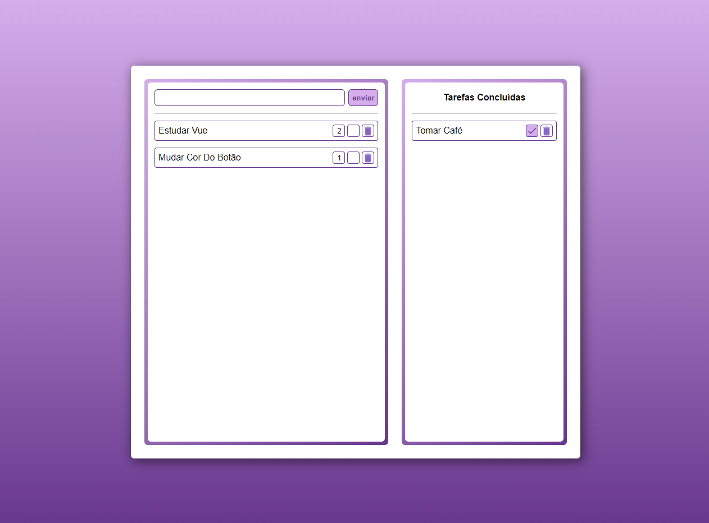
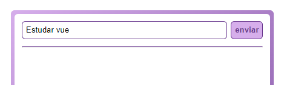
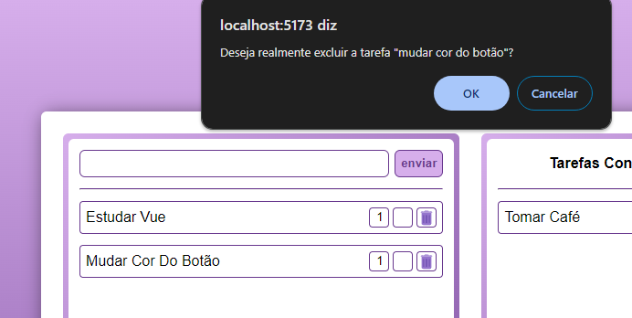
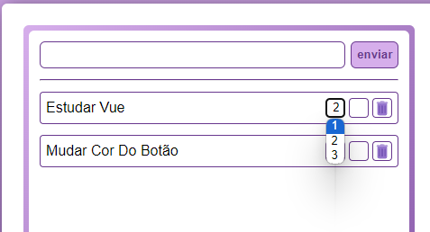

# App Lista de Tarefas
### Seu Assistente Pessoal de Organização!

Bem-vindo ao App Lista de Tarefas, o seu novo melhor amigo para manter a vida organizada e produtiva! Com um design simples e intuitivo, nosso aplicativo ajuda você a acompanhar suas tarefas diárias, metas e projetos de forma eficiente.

## Funcionalidades principais:

### Interface Amigável:
  Design limpo e intuitivo, fácil de usar para todas as idades.
  

    
  

### Adicionar Tarefas: 
  Crie novas tarefas rapidamente com apenas alguns clicks.
   

    
  

### Excluir Tarefas: 
Remova facilmente tarefas que você não precisa mais, mantendo sua lista sempre atualizada.
 

    
  

### Definir Prioridades: 
Marque tarefas importantes para que você saiba no que focar primeiro.
 

    
  

Seja para estudar, trabalhar ou apenas para organizar sua rotina diária, a Lista de Tarefas está aqui para ajudar você a alcançar seus objetivos de maneira mais simples e eficaz. Comece a transformar sua vida com mais organização e produtividade!
